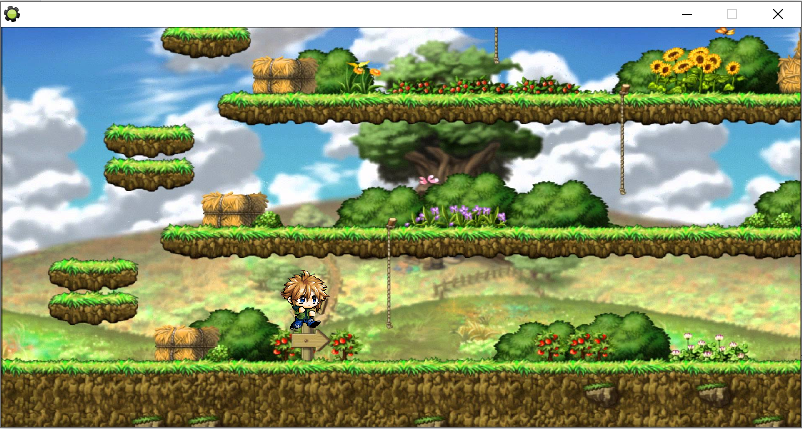

# Maplestory-Simulator-2015-Discontinued-
A fun side project that simulates a famous MMORPG, Maplestory. Project made in Game Maker 8 Pro.
<br />
See `Maplestory.png` for preview.


# Installation Instruction
Debug and run `MAPLE.gmk` through Game Maker 8
<br />
Executable file unavailable
# Movement Controls
```
- ARROW Right -> Move Right/Climb Rope
- ARROW Left -> Move Left
- ARROW Down -> Crouch/Descend Rope
- SPACE -> Jump
```
